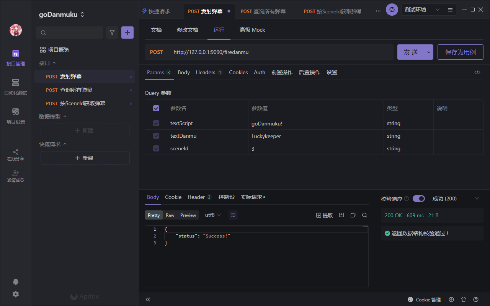
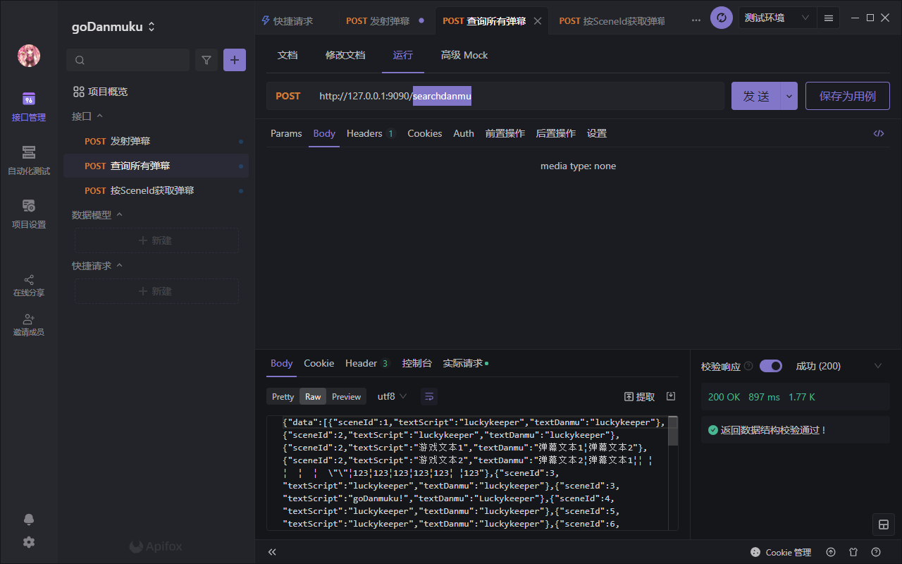
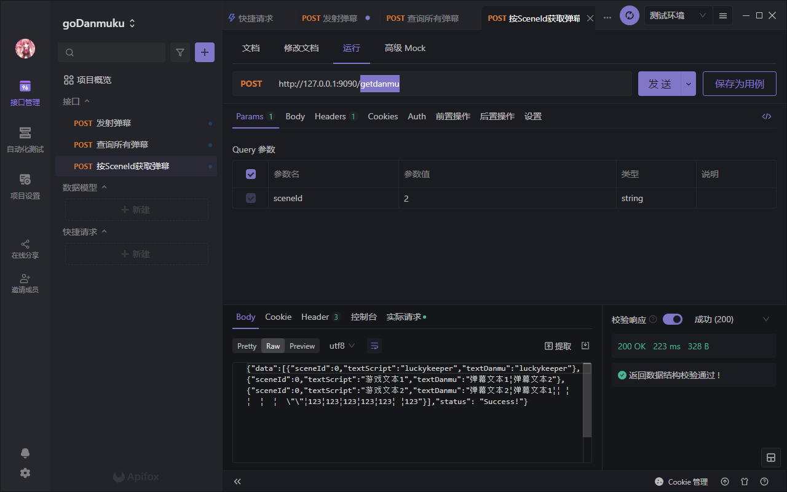

goDanmuku——适用于Ren'Py的弹幕姬（后端）

**本项目许可开源项目和免费游戏在MIT协议下使用，请不要用于商业项目**

第一次写 GO ，希望能够获得您的 Star 支持！

Ren'Py 客户端正在开发中，敬请期待……

## 功能

- 发射弹幕



- 获取全部 Scene 弹幕



- 按 Scene 获取弹幕



## 注意事项

- 数据库使用 PostgreSQL ，首次启动会自动判断建表，不需要 sql 文件
- 请在 `config/config.json` 配置启动参数再启动，配置参数意义见下方解释

```json
# json 文件内请不要写注释，这里的注释仅供参考，在 json 文件内写注释将会导致 json 无法解析，程序无法启动，还请注意
{
    "ServerPort":"9090", # 弹幕姬服务端口，HTTP 协议，可以用 Nginx 反代
    "username": "postgres", # postgres 数据库的用户名
    "password": "luckykeeper", # postgres 数据库的密码
    "address": "192.168.1.50", # postgres 数据库的 IP
    "port": 5432, # postgres 数据库的端口（默认：5432）
    "gameName":"love69", # 游戏名称，单服务器支持多游戏的功能将会在未来开发，目前只能支持一个
    "sceneNumber":22, # 游戏的 Scene 数，比如有 22 个就写 22 个，不需要从 0 计数
    "allowUA":"LuckyRenPy,Powered By Luckykeeper" # RenPy 中客户端携带的 UA ，用于防止恶意客户端校验用
}
```

- 如果正常启动，可以访问指定的服务端口检验是否正常运行，界面应该是这个样子滴


- 仍在开发过程中，建议不要在生产环境使用